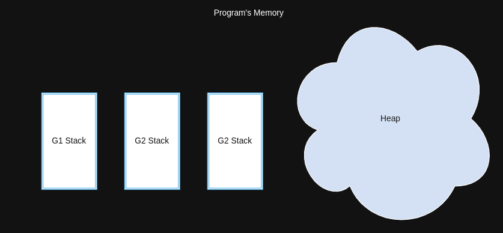

## Memory Management in go

- Go usage GC to manage memory
- Go GC is based on **Tricolor mark-and-sweep Algorithms**
- Go GC is concurrent

## Memory Layout of a go programe

## Stack and Heap memory allocation

- Go automatically determines stack vs. heap allocation
- Local variables and function calls stores in a **stack** (fast , auto-managed we don't need GC for stack).
- Dynamically allocated memory stores in a **heap** (slower, managed by GC).

### Whey does it matter?

- Dose not matter for the correctness of your program.
- DOES affect the performance of your program.
- Anything on the heap is managed by the Garbage collector
- The GC is very good, but it causes latency for the whole program, not just the part creating garbage.

#### When are values constructed on the heap or stack?

- When a value could possibly be referenced after the function that constructed the value returns.
- When the compiler determines a value is too large to fit on the stack
- When the compiler doesn't know the size of a value at compile time
- **Sharing up typically escapes to the heap**
- **Sharing down typically stays on the stack**
- Go only puts function variables on the stack if it can prove a variable is not used after the fucation returns

#### Commonly heap allocated values

- Values shared with Pointers
- Variables stored in interface variables
- Func literal variables
    - Variables captured by a closure
- Backing data for Maps, Channels, Slices, and Strings

#### `new` vs `make`

- *New* only allocates memory, it dose not initialize it 
- *Make* creates and initialized default value 
- *New* return allocates zeroed address 
- *Make* return initialized value of type T

zero values of various types

| type | value |
|------|-------|
| int  | 0     |
| float32  | 0     |
| float64  | 0     |
| string  | ""     |
| boolean  | false     |
| pointers  | nil     |
| slices  | nil     |
| map  | nil     |
| channels  | nil     |
| struct  | resprected value  |

